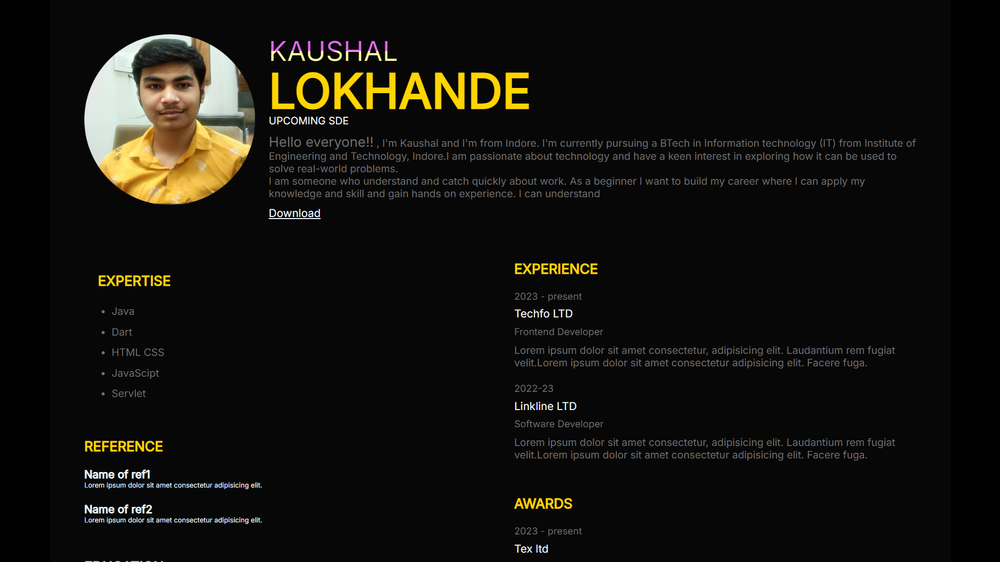

# Personal CV Webpage

This is a personal CV webpage designed to showcase the professional profile, skills, experience, education, and other relevant information of Kaushal Lokhande. The page is built using HTML and CSS, with Feather Icons integrated for iconography.



## Features

- **Profile Section:** Displays an image, name, and a brief introduction.
- **Skills:** Lists the technical skills and areas of expertise.
- **Education:** Highlights educational background.
- **Experience:** Details professional experience in relevant fields.
- **Certifications:** Lists certifications and courses completed.
- **Awards:** Showcases any awards received.
- **Interests:** Displays hobbies and personal interests with icons.
- **Contact Information:** Provides contact details including address, phone number, and email.
- **Social Links:** Links to LinkedIn, GitHub, and Instagram profiles.

## Technologies Used

- **HTML5**
- **CSS3**
- **Feather Icons**
- **JavaScript**

## How to Use

1. **Clone the repository:**

   ```bash
   git clone https://github.com/Kaushallokhande/Personal-CV.git
